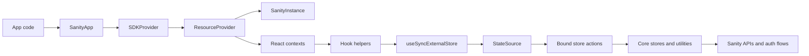

# SDK Developer Onboarding

This guide is for engineers contributing to the SDK repository itself.

It is not primarily a "how to build an app with the SDK" guide. It is a map of how this repo is organized, how the major abstractions fit together, and which parts of the codebase tend to surprise maintainers.

This document is designed to work in two modes:

- async, self-serve onboarding for a new contributor
- a companion document for a live Zoom onboarding session

---

## 🚀 Start Here

If you only remember five things after your first pass through the repo, make them these:

1. `packages/react` is the main developer-facing product surface. Most end users should use `@sanity/sdk-react`.
2. `packages/core` is the framework-agnostic engine underneath it. React mostly adapts core primitives into provider/context/hook ergonomics.
3. A lot of the SDK is organized around `resource`, `perspective`, and `SanityInstance`.
4. The "store" system in `packages/core/src/store` is where state isolation, state sharing, lazy initialization, and cleanup behavior are decided.
5. The React package is not magic. It is mostly a bridge: contexts provide instance/resource/perspective, helpers normalize options, and many hooks subscribe to core `StateSource` objects via `useSyncExternalStore`.

---

## 👥 Who This SDK Is For

The end users of this SDK are developers building custom Sanity apps.

In the most common case, they:

1. initialize an app with `npx sanity@latest init --template app-quickstart`
2. run it with `npm run dev`
3. open it through the Sanity Dashboard
4. use `@sanity/sdk-react` hooks to read data, edit documents, subscribe to changes, and check permissions

The SDK exists so those developers can build apps that feel like first-class Sanity experiences without rebuilding auth, live updates, document editing, permissions, or resource access from scratch.

That end-user context matters when you work on the repo. Most implementation choices are in service of:

- supporting dashboard-hosted apps as the primary use case
- keeping the React API concise and ergonomic
- letting more advanced consumers drop down into lower-level abstractions when needed
- preserving live, multi-resource, auth-aware behavior across many hooks

---

## 🗺️ The Repo In One Picture



---

## 🧭 Repo Map

### `packages/react`

This is the main product surface for app developers.

- npm package: `@sanity/sdk-react`
- provides `SanityApp`, hooks, React handle types, components, and React integration glue
- re-exports core APIs so most consumers only need one package

Start here if the user-facing question is "how would a normal app developer use this?"

### `packages/core`

This is the engine.

- npm package: `@sanity/sdk`
- framework-agnostic business logic
- owns stores, actions, auth, client creation, handle types, resource logic, query/projection logic, and many low-level abstractions

Start here if the question is "where does the real behavior live?"

### `apps/kitchensink-react`

This is the internal sandbox app.

- local manual testing target
- integration surface for many SDK features
- E2E target
- fastest place to validate whether a change feels correct in a real app

Important detail: this app runs with `sanity dev`, not a plain Vite dev server.

### `packages/@repo/e2e`

Shared E2E test infrastructure for the repo.

- Playwright helpers
- dashboard-vs-standalone page handling
- environment assumptions for the hosted E2E setup

This matters because the E2E setup is not a vanilla localhost-only browser test story.

### Root Files Worth Knowing

- `README.md`: external-facing overview of the SDK
- `CONTRIBUTING.md`: setup, testing, and contribution basics
- `package.json`: root scripts and monorepo workflows
- `typedoc.json`: merged docs pipeline
- `.cursor/rules/*.mdc`: repo-specific conventions that are useful even for humans

---

## ⚠️ The Naming Trap

Folder names and package names do not line up as literally as you might expect:

- `packages/core` publishes `@sanity/sdk`
- `packages/react` publishes `@sanity/sdk-react`

If you are tracing package behavior, trust `package.json` exports and package names more than folder intuition.

---

## 📖 How To Use This Guide

Recommended order:

1. Read this file once quickly.
2. Skim the key files linked in each section.
3. Run the kitchensink app.
4. Read the "WTF Index" before making deeper architectural changes.
5. Use the reading path at the end for your second pass.

For a live onboarding meeting, this doc works well as the agenda:

1. product and end-user framing
2. repo map
3. architecture walkthrough
4. deep dive into core
5. deep dive into React
6. gotchas and questions

---

## 🛠️ Daily Contributor Workflow

### Setup

From the repo root:

```bash
pnpm install
pnpm dev
pnpm test
```

Useful root commands:

- `pnpm dev`: runs the kitchensink app
- `pnpm test`: runs Vitest
- `pnpm test:e2e:dashboard`: dashboard-oriented Playwright runs
- `pnpm test:e2e:webkit`: separate WebKit E2E run
- `pnpm build:docs`: generates package docs JSON and then runs the merged TypeDoc build

### Where To Validate Changes

- changed hook or provider behavior: validate in `packages/react` tests and the kitchensink app
- changed low-level logic: validate in `packages/core` tests first, then kitchensink if behavior is user-visible
- changed auth or dashboard behavior: always think about iframe, dashboard, studio, and standalone implications
- changed browser behavior: E2E is especially important

### How To Decide Where A Change Belongs

Put code in `packages/core` when it is:

- framework-agnostic
- business logic rather than React ergonomics
- useful to non-React consumers or to the React layer itself
- fundamentally about stores, actions, clients, auth, resources, or data state

Put code in `packages/react` when it is:

- about providers, hooks, context, suspense, or component-level ergonomics
- adapting core types to React usage
- resolving context-derived defaults like `resourceName` or `perspective`
- bridging core subscriptions into React render semantics

Use `apps/kitchensink-react` when you need:

- a manual reproduction
- an example of intended behavior
- a place to prove the UX or developer ergonomics

---

## 🧠 The Big Mental Model

At a very high level:

- core owns the actual SDK behavior
- React provides a tree-shaped environment for that behavior
- hooks mostly translate "current React context + hook params" into calls into core
- many core read APIs expose `StateSource` objects
- React hooks subscribe to those state sources with `useSyncExternalStore`

Another way to say it:

- `packages/core` decides what the state is, who shares it, when it updates, and when it is disposed
- `packages/react` decides how a React tree gets access to that state

---

## 🏗️ Core Concepts You Need Early

### Resource

A resource says where data lives.

Examples:

- `{projectId, dataset}`
- `{mediaLibraryId}`
- `{canvasId}`

Why this matters:

- most APIs are scoped to a resource
- resource identity is used for store isolation
- React can infer a default resource from context
- named resources let one app work with multiple data sources

### Perspective

Perspective changes how content is viewed, especially around drafts and releases.

Why this matters:

- some stores are keyed by resource only
- others are keyed by resource plus perspective
- a surprising amount of behavior depends on whether perspective is explicit, inherited, or defaulted

### Handle

Handles are typed pointers.

Examples:

- `ResourceHandle`
- `DocumentTypeHandle`
- `DocumentHandle`

They are intentionally lightweight. They mostly carry enough identity to let other APIs do useful work.

Why this matters:

- many hooks and actions compose by passing handles around
- some handle helpers are mainly type-preserving identity helpers, not runtime validators
- React and core handle types are similar but not identical in strictness

### SanityInstance

This is the runtime container for SDK configuration and lifecycle.

It is a core concept that React wraps but does not replace.

Why this matters:

- store sharing and cleanup are tracked against `SanityInstance`
- `ResourceProvider` creates one at the root
- nested resource providers do not create a new instance

---

## 🔄 Architecture Walkthrough: From App Code To Core

### Step 1: `SanityApp`

File: `packages/react/src/components/SanityApp.tsx`

This is the normal public entry point for a React app.

It does a few important things:

- accepts `config` and `resources`
- derives them from `SDKStudioContext` if running inside Studio and props are omitted
- forwards everything to `SDKProvider`
- may redirect to `https://sanity.io/welcome` in certain non-local, non-iframe misconfiguration cases

That last bullet is easy to miss and explains some "why did the app navigate away?" debugging sessions.

### Step 2: `SDKProvider`

File: `packages/react/src/components/SDKProvider.tsx`

This is internal glue.

Its biggest job is establishing the split between:

- the active root resource, which comes from `resources["default"]`
- the full named resources map, which goes into `ResourcesContext`

That split matters a lot:

- the resource named `"default"` becomes the root active resource context
- other named resources are available for hooks that resolve `resourceName`

This means the resources map is not "one instance per resource."

### Step 3: `ResourceProvider`

File: `packages/react/src/context/ResourceProvider.tsx`

This component is one of the most important pieces in the whole repo.

You can think of it as the thing that gives a subtree its current identity.

Root behavior:

- creates a `SanityInstance`
- provides `SanityInstanceContext`
- provides `ResourceContext`
- provides `PerspectiveContext`
- wraps children in `Suspense`
- disposes the instance on unmount, with special handling for quick remounts in Strict Mode

Nested behavior:

- does not create a new instance
- overrides resource and/or perspective for the subtree
- still provides a suspense boundary

If you do not internalize this root-vs-nested distinction, a lot of the React package looks stranger than it really is.

### Important Clarification: `ResourceProvider` Does Not Directly Create Stores

This is an easy place to get the wrong mental model.

`ResourceProvider` does not eagerly create document stores, fetcher stores, or other resource-scoped stores just because it rendered.

What it actually creates is:

- a `SanityInstance` at the root
- the active `resource` and `perspective` contexts for the subtree

The stores come later, lazily, when some bound core action is actually called.

The sequence is more like this:

1. `ResourceProvider` sets up the instance and current subtree context.
2. A hook or core function runs.
3. That code calls a bound action.
4. The binder looks at the current `SanityInstance` plus the resource/perspective options passed in.
5. Only then does the system either create or reuse the right store instance.

So `ResourceProvider` creates the environment that makes store lookup possible. It is not itself a "store factory."

Another way to say it: `ResourceProvider` sets the stage, but the stores only walk on when some code actually calls for them.

### When A New Store Gets Created vs Reused

The short answer is:

- same store definition + same binder key -> reuse existing store instance
- same store definition + different binder key -> create a different store instance

And the binder key usually depends on one of these:

- global
- resource
- resource + perspective

That means:

- rendering a nested `ResourceProvider` does not automatically create a new store
- but if code inside that subtree calls a resource-bound action with a different effective resource, the binder will choose a different store bucket
- if code inside that subtree uses the same effective resource and perspective as before, it will reuse the existing store bucket

### Concrete Example

Imagine this shape:

```tsx
<ResourceProvider resource={{projectId: 'a', dataset: 'production'}} fallback={<div>Loading</div>}>
  <SectionA />
  <ResourceProvider resource={{projectId: 'a', dataset: 'staging'}} fallback={<div>Loading</div>}>
    <SectionB />
  </ResourceProvider>
</ResourceProvider>
```

What happens:

- the outer provider creates one `SanityInstance`
- the inner provider reuses that same instance
- code in `SectionA` that uses a resource-bound document action resolves to the `a/production` store bucket
- code in `SectionB` that uses a resource-bound document action resolves to the `a/staging` store bucket

So:

- one React instance
- two resource contexts
- potentially two separate resource-scoped store instances, but only if code actually touches both

That is the distinction that usually unlocks this part of the architecture.

---

## 🌳 React Context Layer: The Big Ticket Pieces

Directory: `packages/react/src/context`

### `SanityInstanceContext`

Holds the current core `SanityInstance`.

This is the bridge from the React tree into core behavior.

### `ResourceContext`

Exported from `DefaultResourceContext.ts`.

Holds the active resource for the current subtree.

This is not the same thing as the named resources map.

### `ResourcesContext`

Holds `Record<string, DocumentResource>`.

This is used for `resourceName` resolution.

Think of it as named resource lookup, not the current active resource.

### `PerspectiveContext`

Holds the current active perspective for the subtree.

### `SDKStudioContext`

Lets Studio supply workspace-derived config and auth inputs.

This is why `SanityApp` can derive config automatically when embedded in Studio.

### `ComlinkTokenRefresh`

This is part of the dashboard/studio integration story. It is worth knowing about any time auth behavior looks host-environment-specific.

---

## 🪝 React Hook Bridge: Why `useSyncExternalStore` Shows Up

The important files are:

- `packages/react/src/hooks/helpers/createStateSourceHook.tsx`
- `packages/react/src/hooks/helpers/useNormalizedResourceOptions.ts`
- `packages/react/src/hooks/helpers/createCallbackHook.tsx`

### The Core Idea

Core often exposes a `StateSource<T>` rather than a React hook.

A `StateSource` has three access patterns:

- `getCurrent()`
- `subscribe()`
- `observable`

That makes it usable from:

- plain imperative code
- RxJS flows
- React hooks

### `createStateSourceHook`

This helper is the React bridge.

It:

1. gets the current `SanityInstance` from context
2. optionally throws a suspender promise
3. gets a core `StateSource`
4. subscribes to it with `useSyncExternalStore`

This is one of the most important cross-package abstractions in the repo.

If you are wondering "why does this hook stay small even though the behavior is complex?", this is the answer: the complexity mostly lives below it.

### `useNormalizedResourceOptions`

This helper is another key piece of glue.

It normalizes React-layer options into something core can understand by:

- resolving `resourceName` through `ResourcesContext`
- falling back to `ResourceContext`
- injecting perspective defaults from `PerspectiveContext`
- erroring if the options are ambiguous or incomplete

This is why many React APIs feel more ergonomic than the underlying core APIs.

### `createCallbackHook`

This helper is the simpler sibling.

It binds instance-aware core callbacks to the current React tree using `useCallback`.

---

## 🏪 Core Store System: The Most Important Deep Dive

Directory: `packages/core/src/store`

If you work deeply in the repo, learn this area early.

### Do You Need To Know Zustand?

Yes, but only a little.

You do not need to become a Zustand expert to understand this repo.

The useful mental model is:

- Zustand is just the low-level box that holds state and lets code read and write it
- the SDK architecture is everything built around that box
- when people say "the store system" here, they usually mean the SDK's own abstractions, not Zustand itself

In other words:

- Zustand is the engine part
- `defineStore`, action binders, `StateSource`, and instance lifecycle are the transmission, steering, and dashboard around it

If you skip Zustand completely, the store layer can feel like ritual magic. If you over-focus on Zustand, you can miss the actual architecture. The right level is: know what it contributes, then move up one layer.

### The Store System In Plain English

Here is the least pretentious version:

1. `defineStore` describes a kind of stateful thing
2. `createActionBinder` decides who should share one copy of that thing
3. `createStoreInstance` creates the actual live copy when needed
4. `createStoreState` gives that live copy a read/write/subscribe API using Zustand
5. `createStateSourceAction` turns store data into something React and RxJS can consume cleanly

If you like analogies:

- `defineStore` is the blueprint
- `createStoreInstance` is a real apartment built from that blueprint
- `createActionBinder` decides which tenants share a building and which tenants get a different building
- `createStoreState` is the plumbing and wiring inside the apartment
- `createStateSourceAction` is the window that lets the outside world look in without tearing down the wall

That is obviously imperfect, but it is much closer to the lived reality of this code than a lot of abstract state-management language.

### The Most Important Question: "Who Shares State?"

This is the question that makes the whole area click.

Do not start by asking "what does this helper do?"

Start by asking:

- what is the unit of state here?
- who is supposed to share it?
- what event should create it?
- what event should destroy it?

Most of the weirdness in this folder becomes much more reasonable once you realize it is mostly answering those four questions.

### `defineStore`

This defines a store blueprint.

The important parts are:

- the store name
- `getInitialState`
- optional `initialize`

The definition is not the live store.

It is just the recipe.

That means `defineStore(...)` is surprisingly unmagical. It mostly says:

- "when a store of this type is created, start with this state"
- "if needed, run this setup code"
- "when disposed, run this cleanup code"

If this function feels too simple, that is because most of the real behavior is intentionally elsewhere.

### `createStoreInstance`

This creates a real instance of a store for a given `SanityInstance` and key.

This is where initialization actually happens.

This is the moment the blueprint turns into a live thing.

That is an important distinction:

- `defineStore` does not create long-lived state
- `createStoreInstance` does

If you are debugging when setup runs, when listeners attach, or when cleanup happens, this is part of the answer.

### `createStoreState`

This is the state container wrapper.

This is the main place where Zustand shows up.

Important detail:

- it exposes `get`, `set`, and an observable stream
- the first arg to `set` is used as the devtools action name

What Zustand is doing here:

- storing the current state object
- letting the SDK update that state
- letting the SDK subscribe to changes

What the SDK adds on top:

- a consistent `StoreState` interface
- RxJS `observable` access
- naming for devtools/debugging

So if you are ever wondering "where is the actual state stored?", the honest answer is: in a small vanilla Zustand store wrapped by SDK abstractions.

### `createActionBinder`

File: `packages/core/src/store/createActionBinder.ts`

This is one of the most important files in the whole repo.

It decides who shares state.

The binder:

- derives a key
- combines that key with the store name into a composite key
- keeps a registry of which `SanityInstance`s are using that composite key
- lazily creates the store instance the first time it is needed
- disposes the store instance when the last interested instance goes away

The three patterns you will see a lot are:

- `bindActionGlobally`
- `bindActionByResource`
- `bindActionByResourceAndPerspective`

When a bug feels like "why is this state shared?" or "why is this state not shared?", the answer is usually here.

You can think of the binder as the sorter for store state. It looks at the request, decides which bucket it belongs in, and sends it there.

If you want the blunt version:

- binder key same -> shared store
- binder key different -> separate store
- last interested instance goes away -> store can be disposed

This is the place where the repo's state-sharing policy actually lives.

#### A Real Example: `documentStore`

In `packages/core/src/document/documentStore.ts`, the document store is bound with `bindActionByResource`.

That means:

- one dataset resource gets one document store instance
- a different dataset resource gets a different document store instance
- the store is not global across all resources

That is exactly what you would want for document state. A `projectA/production` document cache should not silently share state with `projectB/testing`.

This is a good file to read when the abstraction still feels theoretical, because it shows the binder rule attached to a domain concept that already makes intuitive sense.

#### The Sanity Check To Run In Your Head

Whenever you see a bound action, mentally rewrite it as:

- "this action reads or writes this store"
- "but only inside the state bucket chosen by this binder"

That one sentence explains a lot of the architecture.

### `createStateSourceAction`

This is where a lot of the core-to-React bridge starts.

It turns a selector into a `StateSource`.

Important details:

- selectors receive `{state, instance}`
- `onSubscribe` can do setup and cleanup
- equality filtering avoids unnecessary updates
- the selector context is cached with `WeakMap`s

Why this matters:

- it explains how a store selector becomes something React can subscribe to
- it explains why some logic can be shared between RxJS and React

In plain English, this helper says:

- "take some store state"
- "derive the piece we care about"
- "give me something with get/subscribe/observable so other layers can consume it"

That is why it is such an important bridge abstraction.

#### A Real Example: `getDocumentState`

Also in `packages/core/src/document/documentStore.ts`, `getDocumentState` is created by combining:

- `documentStore`
- `bindActionByResource`
- `createStateSourceAction(...)`

The selector does not fetch data itself. It says:

- look at the document-related state for the current resource
- derive the document or path value we care about
- return that value as a `StateSource`

Then `onSubscribe` handles subscriber tracking so the system knows whether that document state is still needed.

This is the pattern to internalize:

- binder chooses the right store instance
- selector picks the useful slice of data
- `StateSource` exposes that slice in a form React and RxJS can both consume

#### Why This Feels Weird At First

At first glance, `createStateSourceAction` can feel too abstract because it is not "the fetcher" and not "the hook" and not "the store" either.

That is exactly why it exists.

It is the adapter between those things.

Without it, each feature would have to reinvent the same "current value + subscriptions + reactive stream" shape over and over.

### `createSanityInstance`

This gives the store system something concrete to key lifecycle against.

If you are tracing disposal behavior, do not stop at React providers. Follow through to instance disposal and then back into action binder cleanup.

### Store Lifecycle In Five Steps

If the whole system still feels fuzzy, use this sequence:

1. Some code calls a bound action.
2. The binder computes the composite key and looks for an existing store instance.
3. If none exists, the store instance is created from the definition.
4. Code reads state, writes state, or exposes a `StateSource` for subscribers.
5. When the last relevant `SanityInstance` is disposed, cleanup runs and the store instance can disappear.

That is the lifecycle.

Everything else is mostly refinement.

---

## 🧰 Core Utility Deep Dive: The Other Important Area

Directory: `packages/core/src/utils`

### `createFetcherStore`

This is one of the highest-value files to understand.

It creates a parameterized fetch/cache/subscription store.

Key ideas:

- state is keyed by serialized params
- the store is globally bound
- adding a subscription can trigger a fetch
- fetches are throttled
- state can expire after the last subscription disappears
- `resolveState` turns the reactive state source into a promise for the next defined value

This is easy to misread as "just a cache helper." It is really a reactive fetch orchestration pattern.

#### The Blunt Mental Model

If `createFetcherStore` feels like wizard code, translate it to this:

- "keep one state entry per request key"
- "when someone starts caring about a key, fetch it"
- "if they stop caring, eventually forget it"
- "if they ask again too soon, do not spam the network"

That is basically what it does.

The implementation is reactive because the SDK needs to coordinate all of that without every caller managing it by hand.

#### What Is Actually Happening

For each key:

1. a subscriber appears
2. the key gets a subscription record in store state
3. the subscription-count change is observed
4. a fetch may be triggered if throttling allows it
5. data or error is written back into the keyed entry
6. when the last subscriber disappears, the keyed state is eventually removed

So this helper is really doing three jobs at once:

- cache bookkeeping
- fetch triggering
- lifecycle cleanup

That is why it looks denser than a normal "data fetching helper."

#### How `resolveState` Fits In

`getState(...)` gives you a reactive `StateSource`.

`resolveState(...)` is the imperative sibling. It waits until the keyed state produces a non-`undefined` value, then resolves a promise.

If `getState(...)` is the version that stays in the conversation, `resolveState(...)` is the version that waits quietly until the data finally shows up and then says, "okay, here you go."

That is useful when some part of core wants the same underlying reactive machinery, but wants to consume it as "wait until ready" rather than "stay subscribed forever."

#### The Main Thing Not To Miss

`createFetcherStore` is globally bound in its own implementation.

That does not mean all data is mashed together. The per-request key still partitions state inside the store.

So the sharing story becomes:

- one global fetcher store container
- many keyed entries inside it
- independent subscription counts and cached results per key

### `listenQuery`

This bridges an initial fetch with live query listening and refetch behavior.

Why it surprises people:

- it is not just "subscribe to query updates"
- it coordinates fetch, listen, debounce, reconnect behavior, and cancellation semantics

### `getEnv`

This abstracts runtime environment lookup across different environments.

Do not assume only one env source exists. The SDK runs in more than one host shape.

### `logger`

This is worth knowing whenever you need to understand debug output or add maintainable logging behavior.

---

## 🔐 Auth: Understand The Modes Before You Change Them

The core auth guide is `packages/core/guides/AuthenticationGuide.md`.

The headline:

- dashboard is the primary happy path
- studio is special and workspace-aware
- standalone exists, but is not the main intended product flow

Important contributor lesson:

auth mode is inferred, not always spelled out in one obvious config flag.

In practice, the SDK looks around at its surroundings and decides which world it thinks it is in: dashboard, studio, or standalone.

This is why auth debugging often requires checking:

- config shape
- iframe context
- URL parameters
- dashboard context
- whether Studio provided a token source

---

## 🏷️ Handles: Small Types, Big Consequences

Handles are conceptually simple but show up everywhere.

Two things are especially worth remembering:

1. handle helpers like `createDocumentHandle` are often mostly about preserving literal types, not doing meaningful runtime construction
2. React-side handle types can be looser than core-side ones because React can supply resource and perspective from context

If you see similar type names in `packages/core` and `packages/react`, do not assume they have exactly the same ergonomics.

---

## 🧪 The Kitchensink App And E2E Are Part Of The Architecture

### Kitchensink

Directory: `apps/kitchensink-react`

This app is not just a demo.

It is:

- a manual testing harness
- an examples app
- a place to validate intended ergonomics
- a target used by E2E

### E2E

Directory: `packages/@repo/e2e`

This setup is unusual compared to a typical SPA repo.

Important details:

- tests are split into dashboard-oriented runs and WebKit runs
- dashboard behavior matters enough that the test abstraction has to account for iframe-vs-not-iframe behavior
- local and CI behavior are not identical by accident; the setup intentionally reflects real hosting constraints

If a UI change only works in a plain local React mental model, it may still be wrong for the actual SDK product context.

---

## 📚 Docs Pipeline

The docs setup is worth understanding because it is not a single simple TypeDoc command.

Each package emits TypeDoc JSON:

- `packages/core`
- `packages/react`

Then the repo root merges that output using `typedoc.json`.

This means:

- package docs and root docs are related but distinct
- some docs live as package READMEs
- some deeper guides live under package `guides/`
- some maintainer-focused docs live outside the normal public docs path

---

## 😵 WTF Index

These are the areas most likely to make a contributor say "what is going on here?"

### 1. `SanityApp` can redirect the page

File: `packages/react/src/components/SanityApp.tsx`

If the app looks misconfigured and it is not local or iframe-hosted, `SanityApp` can redirect to `https://sanity.io/welcome`.

### 2. `AuthBoundary` has import-time side effects

File: `packages/react/src/components/auth/AuthBoundary.tsx`

It can inject a bridge script when the module is evaluated.

### 3. The default resource is not the same thing as the named resources map

Files:

- `packages/react/src/components/SDKProvider.tsx`
- `packages/react/src/context/DefaultResourceContext.ts`
- `packages/react/src/context/ResourcesContext.tsx`

What they actually are:

- the default resource is the current active resource for the subtree
- the named resources map is a lookup table of all declared resources by name

In practice:

- `ResourceContext` answers "what resource should this subtree use by default?"
- `ResourcesContext` answers "if a hook asks for `resourceName: 'foo'`, what resource does that name point to?"

This is one of the easiest things to misunderstand in the React package.

### 4. Nested `ResourceProvider`s do not create new instances

File: `packages/react/src/context/ResourceProvider.tsx`

They override subtree resource and perspective while reusing the parent instance.

### 5. Store sharing is a binder decision, not a component decision

File: `packages/core/src/store/createActionBinder.ts`

If state isolation surprises you, inspect the binder keying strategy.

### 6. `StateSource` is the bridge abstraction

Files:

- `packages/core/src/store/createStateSourceAction.ts`
- `packages/react/src/hooks/helpers/createStateSourceHook.tsx`

This is the seam between core reactivity and React subscriptions.

### 7. `createFetcherStore` is more than a cache

File: `packages/core/src/utils/createFetcherStore.ts`

It coordinates subscription counts, fetch timing, cache state, and expiration.

### 8. Handle helper functions can be mostly type helpers

Files:

- `packages/core/src/config/handles.ts`
- `packages/react/src/config/handles.ts`

Do not assume a helper named `create*Handle` is doing runtime validation.

### 9. Auth mode is inferred

Files:

- `packages/core/src/auth/authMode.ts`
- `packages/core/guides/AuthenticationGuide.md`

Auth behavior often depends on environment and context, not one explicit switch.

### 10. The E2E story is dashboard-aware

Files:

- `packages/@repo/e2e/README.md`
- `packages/@repo/e2e/src/index.ts`

This repo tests the real hosting model, not just a plain localhost SPA.

---

## 🧭 Suggested Reading Path

### First Pass

1. `README.md`
2. `CONTRIBUTING.md`
3. `packages/react/README.md`
4. `packages/core/README.md`
5. this file

### Second Pass

1. `packages/react/src/components/SanityApp.tsx`
2. `packages/react/src/components/SDKProvider.tsx`
3. `packages/react/src/context/ResourceProvider.tsx`
4. `packages/react/src/hooks/helpers/createStateSourceHook.tsx`
5. `packages/react/src/hooks/helpers/useNormalizedResourceOptions.ts`
6. `packages/core/src/store/createActionBinder.ts`
7. `packages/core/src/store/createStateSourceAction.ts`
8. `packages/core/src/utils/createFetcherStore.ts`

### Third Pass

1. `packages/react/internal-guides/Advanced-Resource-Management.md`
2. `packages/core/guides/AuthenticationGuide.md`
3. `packages/core/guides/AboutSDKCore.md`
4. `packages/react/guides/Typescript.md`
5. `packages/@repo/e2e/README.md`

---

## 🗓️ A Good First Week Plan

### Day 1

- read this guide
- run the kitchensink app
- trace one simple hook from `packages/react` into `packages/core`

### Day 2

- read `createActionBinder.ts`
- read `createStateSourceAction.ts`
- read `createStateSourceHook.tsx`

### Day 3

- read `ResourceProvider.tsx`
- trace how resource and perspective get normalized
- inspect one auth flow end to end

### Day 4

- read `createFetcherStore.ts`
- read one query or projection flow that uses it
- validate the behavior in kitchensink or tests

### Day 5

- read the WTF Index again
- pick one area you still do not fully understand
- trace it from public API to core implementation

---

## 🧭 Questions To Ask When You Are Lost

These questions usually get you unstuck faster than staring at one file in isolation:

1. Is this behavior owned by core or by React?
2. What is the active `resource` and `perspective` here?
3. Is this state supposed to be global, resource-scoped, or resource-plus-perspective-scoped?
4. Am I looking at a `StateSource`, a raw store action, or a React hook built on top of one?
5. Is the current environment dashboard, studio, or standalone?
6. Is this file defining business behavior, or just adapting another layer?

---

## 🏁 Closing Advice

The repo becomes much easier to reason about once you stop thinking of it as "a big React hooks library" and start thinking of it as:

- a core runtime with explicit lifecycle and sharing rules
- a React integration layer that makes that runtime pleasant to use
- a product optimized first for dashboard-hosted Sanity apps

When in doubt, trace the path in this order:

public React API -> React provider/helper layer -> core action/state source -> store binding strategy -> underlying Sanity API behavior
